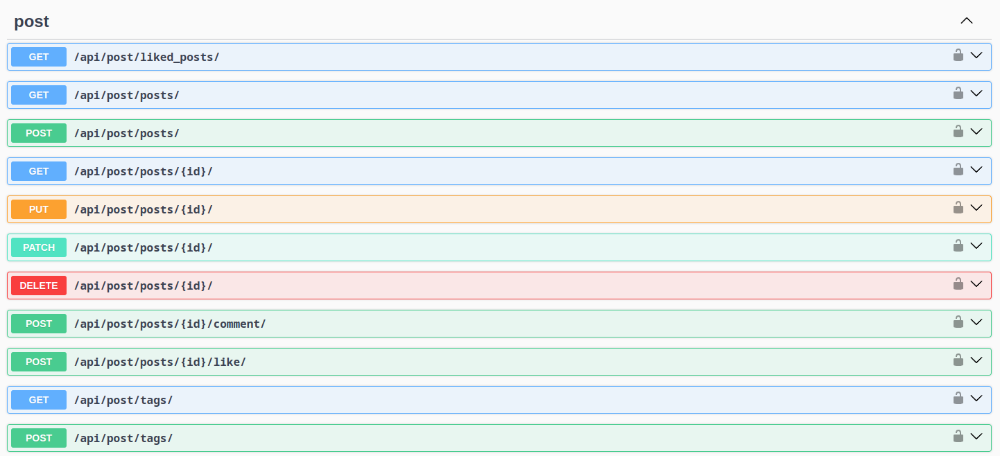
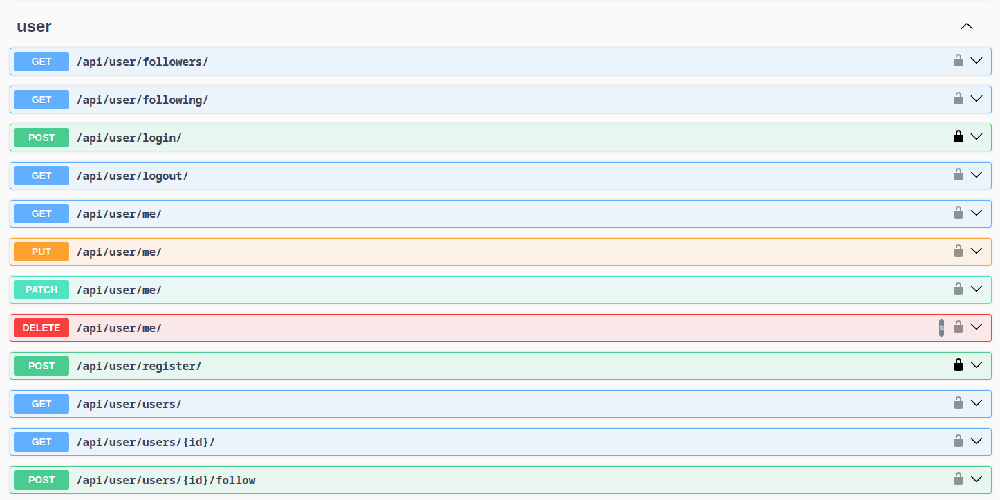

# Social Media API

A RESTful API for a social media platform, allowing users to interact, 
create posts, and manage their profiles.

## Description

This API facilitates the core functionalities of a social media platform. 
Users can create profiles, follow others, manage posts, 
and engage in basic social media actions.

## Setup and Installation

Follow these steps to set up and run the Social Media API project:

### 1. Clone the Repository:

```
git clone https://github.com/nailia-mamiedova/social-media-api
cd social-media-api
```

### 2. Set Up a Virtual Environment:
Depending on your operating system, the commands to set up a virtual environment differ:

#### For macOS and Linux:

```
python3 -m venv venv
source venv/bin/activate
```

#### For Windows:

```
python -m venv venv
.\venv\Scripts\activate
```

### 3. Install the Required Dependencies:

```
pip install -r requirements.txt
```

### 4. Apply Migrations:

This will set up the necessary database tables required for the project.

```
python manage.py migrate
```

### 5. Load Fixture Data:

To populate your database with initial data:

```
python manage.py loaddata fixture_data.json
```

### 6. Start the Project:

Finally, run the Django development server:

```
python manage.py runserver
```

You should now be able to access the API at http://127.0.0.1:8000/.

## Usage

---

You can use existing credentials to log in to the API, or create a new account.

### Existing Credentials:

**Admin:**

- Email: _admin@gmail.com_
- Password: _admin_

**Simple users:**

- Email: _user@gmail.com_
- Password: _1qazcde3_

- Email: _new.user@gmail.com_
- Password: _1qazcde3_

## Features

### User Registration and Authentication:

- **Register:** Users can sign up using their email, username, and password.
  - Endpoint: _api/user/register_
- **Login:** Users can log in to receive an authentication token.
  - Endpoint: _api/user/login_
- **Logout:** Users can log out, invalidating their current token.
  - Endpoint: _api/user/logout_

### User Profile:

- **Profile Management:** Users can create and update their profile, adding details like a profile picture and bio.
  - Endpoint: _api/user/me_
- **View Profiles:** Users can view the profiles of others.
  - Endpoint: _api/user/users_
- **Search:** Users can search for others by username.

### Follow/Unfollow:

- **Follow/Unfollow:** Users can follow or unfollow other users.
  - Endpoint: _api/user/follow/<pk>_
- **View Followers/Following:** Users can see who they're following and who's following them.
  - Endpoints: _api/user/following_, _api/user/followers_

### Post Creation and Retrieval:

  - **Create Posts:** Users can create posts with title, text, tags and optional media attachments.
    - Endpoint: _api/post/posts_
  - **View Posts:** Users can view their posts and those of users they follow.
  - **Search Posts:** Users can find posts by tag.

### Likes and Comments:

- **Like/Unlike:** Users can like or remove likes from posts.
  - Endpoint: _api/post/posts/<pk>/like_
- **Comments:** Users can comment on posts and view existing comments.
    - Endpoint: _api/post/posts/<pk>/comment_
- **View Liked Posts:** Users can see a list of posts they've liked.

### API Permissions:

- **Authentication:** Only authenticated users can use the API.
  - Default Permission Class: _IsAuthenticated_
- **User Restrictions:** Users can only modify or delete their own posts and profiles.
  - Endpoint: _api/user/me_, _api/post/posts/<pk>_

## API Documentation:

- **Documentation:** Comprehensive API documentation is available, detailing the usage of each endpoint.
  - Tool Used: _drf-spectacular_
  - Endpoint: /api/schema/swagger/ or /api/schema/redoc/
- **Samples:** The documentation provides sample requests and responses for various endpoints.

### API Endpoints

#### 1. Post App Endpoints



#### 2. User App Endpoints


